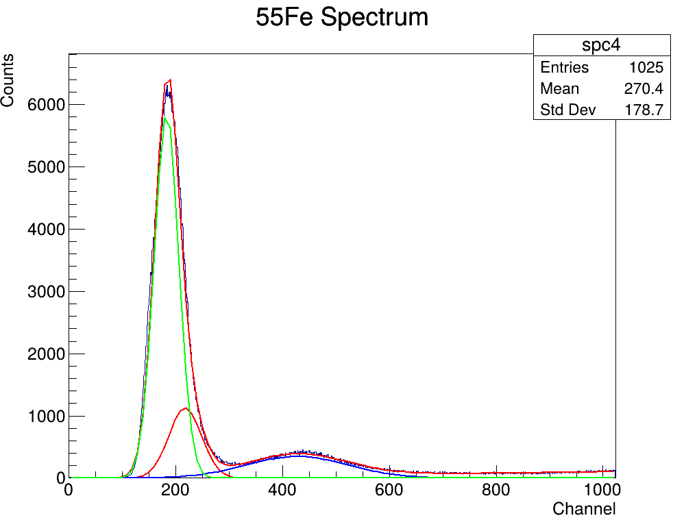

# Exercise 1 - Spectrum analysis on $^{55}$Fe using ROOT

**Aristotle University of Thessaloniki**  
**Physics Department**  
**Author:** Konstantinos E. Stergiou  
**Date:** April 15, 2025  

---

## 📋 Table of Contents

- [Introduction](#introduction)
- [Complete ROOT Script](#complete-root-script)
- [Step-by-Step Breakdown](#step-by-step-breakdown)
  - [Step 1: Histogram creation](#step-1-histogram-creation)
  - [Step 2: Data loading](#step-2-data-loading)
  - [Step 3: Fit function definition](#step-3-fit-function-definition)
  - [Step 4: Initial parameters](#step-4-initial-parameters)
  - [Step 5: Fit](#step-5-fit)
  - [Step 6: Plot](#step-6-plot)
  - [Step 7: Peak ratio](#step-7-peak-ratio)
- [Results](#results)

---

## 📘 Introduction

In this exercise, we analyze a gas detector spectrum obtained by irradiation with 5.9 keV X-rays from a $^{55}$Fe source. Due to electronic noise, the escape peak at ~2.7 keV is partially masked. A multi-Gaussian fit with linear background is performed to extract and quantify the relative peak intensities.

### 🔑 Key points

- **Source:** $^{55}$Fe emits characteristic X-rays at 5.9 keV (85%) and 6.5 keV (15%)  
- **Escape Peak:** Argon K-shell escape reduces energy by ~3.2 keV, forming a peak at ~2.7 keV  
- **Method:** Fit includes 3 Gaussians + linear background  
- **Goal:** Determine the intensity ratio between the 5.9 keV and escape peaks  

---

## 💻 Complete ROOT Script

```cpp
// analyze_55Fe.C
// ROOT script for 55Fe spectrum analysis

void analyze_55Fe() {
    // 1. Create histogram
    TH1F *spc4 = new TH1F("spc4", "55Fe Spectrum;Channel;Counts", 1024, 0, 1024);

    // 2. Read data file
    FILE *fp4 = fopen("QMO_5310.TXT", "r");
    if (!fp4) {
        std::cerr << "Error: Cannot open file!" << std::endl;
        return;
    }

    char line[80];
    int chnl, entr, nn;
    while (fgets(line, 80, fp4)) {
        sscanf(line, "%d,%d %d", &chnl, &entr, &nn);
        spc4->SetBinContent(chnl, entr);
    }
    fclose(fp4);

    // 3. Define fit function (3 Gaussians + linear background)
    TF1 *fitFunc = new TF1("fitFunc", 
        "[0]*exp(-0.5*((x-[1])/[2])^2) + "  // 5.9 keV peak
        "[3]*exp(-0.5*((x-[4])/[5])^2) + "  // 6.5 keV peak
        "[6]*exp(-0.5*((x-[7])/[8])^2) + "  // Escape peak
        "[9] + [10]*x",                     // Linear background
        0, 1024);

    // 4. Initial parameters
    fitFunc->SetParameters(
        1120, 220, 30,    // 5.9 keV peak
        350, 430, 100,    // 6.5 keV peak
        5850, 180, 20,    // Escape peak
        -3, 0.1           // Background
    );

    // 5. Perform the fit
    spc4->Fit("fitFunc", "R");

    // 6. Plot results
    TCanvas *c2 = new TCanvas("c2", "55Fe Fit Results", 1000, 800);
    spc4->Draw();
    fitFunc->Draw("same");

    // Draw individual components
    TF1 *g1 = new TF1("g1", "gaus", 0, 1024);
    g1->SetParameters(fitFunc->GetParameter(0), fitFunc->GetParameter(1), fitFunc->GetParameter(2));
    g1->SetLineColor(kRed);
    g1->Draw("same");

    TF1 *g2 = new TF1("g2", "gaus", 0, 1024);
    g2->SetParameters(fitFunc->GetParameter(3), fitFunc->GetParameter(4), fitFunc->GetParameter(5));
    g2->SetLineColor(kBlue);
    g2->Draw("same");

    TF1 *g3 = new TF1("g3", "gaus", 0, 1024);
    g3->SetParameters(fitFunc->GetParameter(6), fitFunc->GetParameter(7), fitFunc->GetParameter(8));
    g3->SetLineColor(kGreen);
    g3->Draw("same");

    // 7. Calculate peak ratios
    double area_59keV = g1->Integral(g1->GetParameter(1)-3*g1->GetParameter(2), 
                             g1->GetParameter(1)+3*g1->GetParameter(2));
    double area_escape = g3->Integral(g3->GetParameter(1)-3*g3->GetParameter(2), 
                             g3->GetParameter(1)+3*g3->GetParameter(2));

    std::cout << "\nResults:\n";
    std::cout << "5.9 keV peak area: " << area_59keV << "\n";
    std::cout << "Escape peak area: " << area_escape << "\n";
    std::cout << "Ratio (5.9keV/Escape): " << area_59keV/area_escape << "\n";

    // 8. Save results
    c2->SaveAs("55Fe_fit_results.png");
}
```

---

## 🧪 Step-by-Step Breakdown

### Step 1: Histogram creation

```cpp
TH1F *spc4 = new TH1F("spc4", "55Fe Spectrum;Channel;Counts", 1024, 0, 1024);
```

- Creates a histogram with 1024 bins from 0 to 1024
- Title: `"55Fe Spectrum"`; X-axis: `"Channel"`; Y-axis: `"Counts"`

---

### Step 2: Data loading

```cpp
FILE *fp4 = fopen("QMO_5310.TXT", "r");
// Read and parse lines, fill histogram
```

- Opens the spectrum data file and populates the histogram with values from the detector.

---

### Step 3: Fit function definition

```cpp
TF1 *fitFunc = new TF1("fitFunc", 
    "[0]*exp(-0.5*((x-[1])/[2])^2) + "
    "[3]*exp(-0.5*((x-[4])/[5])^2) + "
    "[6]*exp(-0.5*((x-[7])/[8])^2) + "
    "[9] + [10]*x",
    0, 1024);
```

- Models 3 Gaussian peaks + a linear background.

---

### Step 4: Initial parameters

```cpp
fitFunc->SetParameters(
    1120, 220, 30,     // 5.9 keV
    350, 430, 100,     // 6.5 keV
    5850, 180, 20,     // Escape
    -3, 0.1            // Background
);
```

- Sets initial guesses for amplitudes, means, sigmas, and background.

---

### Step 5: Fit

```cpp
spc4->Fit("fitFunc", "R");
```

- Performs the fit over the entire histogram range.

---

### Step 6: Plot

```cpp
TCanvas *c2 = new TCanvas("c2", "55Fe Fit Results", 1000, 800);
spc4->Draw();
fitFunc->Draw("same");
```

- Visualizes the histogram and the fitted curve.

---

### Step 7: Peak ratio

```cpp
double area_59keV = g1->Integral(...);
double area_escape = g3->Integral(...);
double ratio = area_59keV / area_escape;
```

- Calculates the area under the 5.9 keV and escape peaks using integration over $\mu \pm 3\sigma$.

---

## 📊 Results



- **5.9 keV peak area:** `87,295.7`  
- **Escape peak area:** `344,669`  

The ratio of the 5.9 keV peak to the escape peak is:

```math
\boxed{0.253}
```

This ratio reflects the detector’s relative response to primary and escape events from $^{55}$Fe X-ray irradiation.

---
