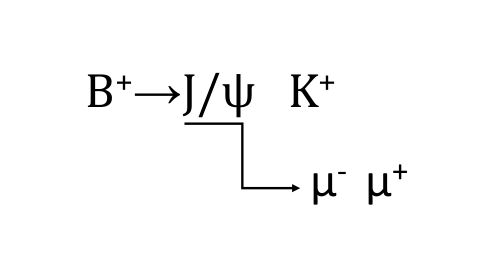

# B⁺ → J/ψ K⁺ Analysis at LHCb

## Introduction

This repository contains the analysis of simulated B⁺ meson decays in proton-proton collisions at the LHC, focusing on the golden channel:

The dataset consists of 10,000 Monte Carlo simulated events stored in `Bplus_JpsiKplus.root`, generated to study detector performance and optimize reconstruction of this important decay chain. The analysis covers:

- Kinematic distributions of B⁺ mesons and decay products
- Muon pair correlations and separation
- Invariant mass reconstruction techniques
- Detector acceptance optimization
- Cross-section calculations

This decay channel is particularly valuable for:
- CP violation studies in B meson system
- Calibration of detector performance
- New physics searches through precision measurements

The analysis follows the ROOT framework and is organized in modular steps, each with dedicated documentation and code.
