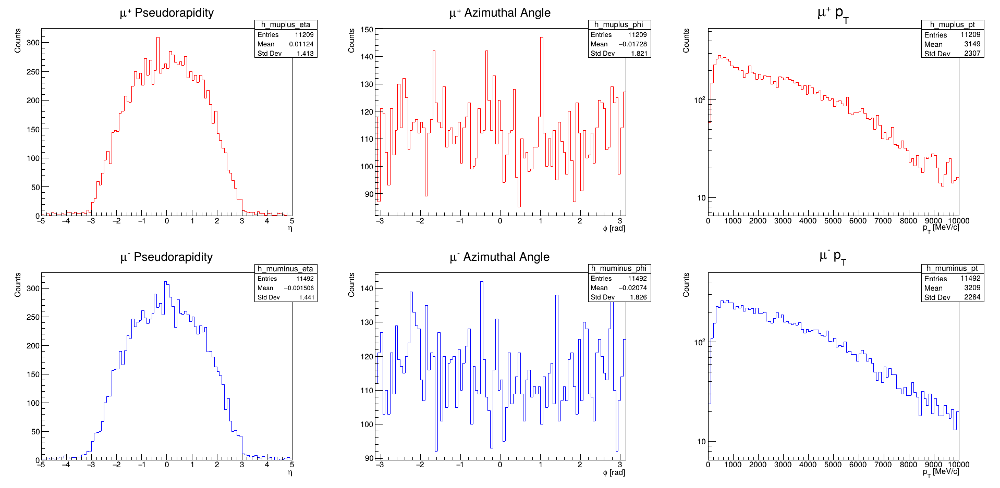

# Muon Kinematics Analysis - Step 2

## Description
This code analyzes the kinematic properties of the muon pair (μ⁺μ⁻) from J/ψ decays in the B⁺ → J/ψ K⁺ channel. It provides detailed distributions of the decay products' properties.

## Key Features
- **Dual Muon Analysis** for both μ⁺ and μ⁻:
  - Pseudorapidity (η) distributions
  - Azimuthal angle (φ) distributions
  - Transverse momentum (pT) spectra (log scale)

- **Visualization**:
  - 3×2 grid canvas layout
  - Color-coded plots (red for μ⁺, blue for μ⁻)
  - Logarithmic y-axis for pT distributions
  - Interactive display for manual inspection

## Physics Quantities Studied
| Variable   | Particle | Range          | Units     |
|------------|----------|----------------|-----------|
| η          | μ⁺/μ⁻    | [-5, 5]        | -         |
| φ          | μ⁺/μ⁻    | [-π, π]        | radians   |
| pT | μ⁺/μ⁻ | [0, 10000]     | MeV/c     |

## Physics Context
The analysis of muon kinematics is crucial for:
- Validating J/ψ reconstruction
- Understanding detector acceptance
- Optimizing trigger efficiency
- Studying detector performance for muon identification

## Usage Notes
- The plots remain open for manual saving through ROOT's GUI
- Close the window to terminate the program
- All histograms use 100 bins in their respective ranges
