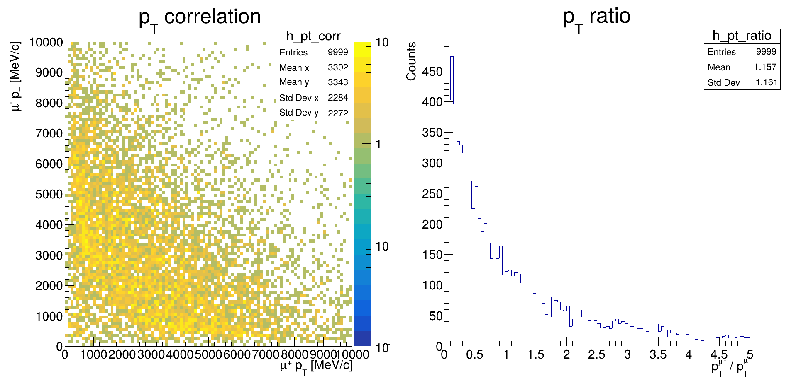

# Muon pT Correlations Analysis - Step 3

## Description
This code analyzes the transverse momentum (pT) correlations between the muon pair (μ⁺μ⁻) from J/ψ decays in B⁺ → J/ψ K⁺ events. It provides:

## Key Features
- **2D Correlation Plot**:
  - pT(μ⁺) vs pT(μ⁻) with logarithmic color scale
  - 100×100 bins in [0, 10000] MeV/c range

- **pT Ratio Distribution**:
  - Ratio pT(μ⁺)/pT(μ⁻)
  - 100 bins in [0, 5] range

## Physics Quantities Studied
| Plot Type | Variables | Range | Units/Bins | Scale |
|-----------|-----------|-------|------------|-------|
| 2D Correlation | pT(μ⁺) vs pT(μ⁻) | [0, 10000] | 100×100 bins | Logarithmic |
| Ratio Distribution | pT(μ⁺)/pT(μ⁻) | [0, 5] | 100 bins | Linear |

## Physics Context
This analysis helps understand:
- Momentum balance in J/ψ → μ⁺μ⁻ decays
- Possible detector biases in muon reconstruction
- Trigger efficiency dependencies
- QED radiation effects in di-muon decays

## Usage Notes
- The 2D plot uses logarithmic z-scale for better dynamic range
- Ratio plot helps identify asymmetric decays
- Plots remain interactive for detailed inspection
- Close window to terminate the program
