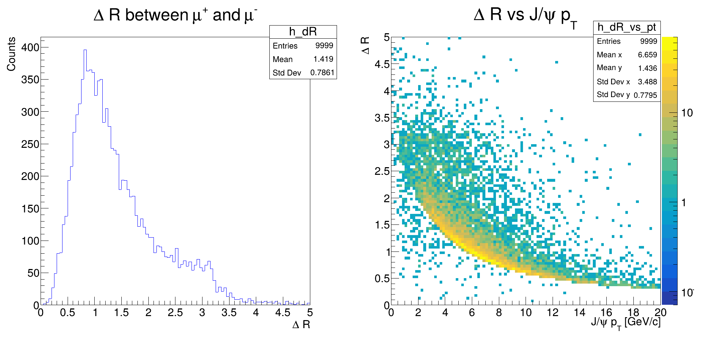

# Muon Separation Analysis - Step 4

## Description
This code analyzes the angular separation between muons (μ⁺μ⁻) from J/ψ decays in B⁺ → J/ψ K⁺ events, focusing on the ΔR distribution and its correlation with J/ψ momentum.

## Key Features
- **ΔR Distribution**:
  - Angular separation ΔR = √(Δη² + Δφ²) between μ⁺ and μ⁻
  - 100 bins in [0, 5] range
  - Blue color scheme

- **ΔR vs J/ψ pT Correlation**:
  - 2D histogram of ΔR vs J/ψ pT
  - pT range [0, 20] GeV/c (converted from MeV)
  - Logarithmic color scale for enhanced visibility

## Physics Quantities Studied
| Plot Type | Variables | Range | Units/Bins | Special Features |
|-----------|-----------|-------|------------|------------------|
| ΔR Distribution | ΔR(μ⁺μ⁻) | [0, 5] | 100 bins | Linear scale |
| 2D Correlation | ΔR vs J/ψ pT | [0,20]×[0,5] GeV/c×ΔR | 100×100 bins | Log z-scale |

## Physics Context
This analysis reveals:
- Opening angle distribution of J/ψ decay products
- pT dependence of muon pair separation
- Detector acceptance effects
- QED radiation patterns in dimuon decays

## Usage Notes
- The ΔR plot shows characteristic J/ψ decay kinematics
- Correlation plot helps identify detector edge effects
- J/ψ pT displayed in GeV/c for better readability
- Interactive plots for detailed inspection
- Close window to terminate program
