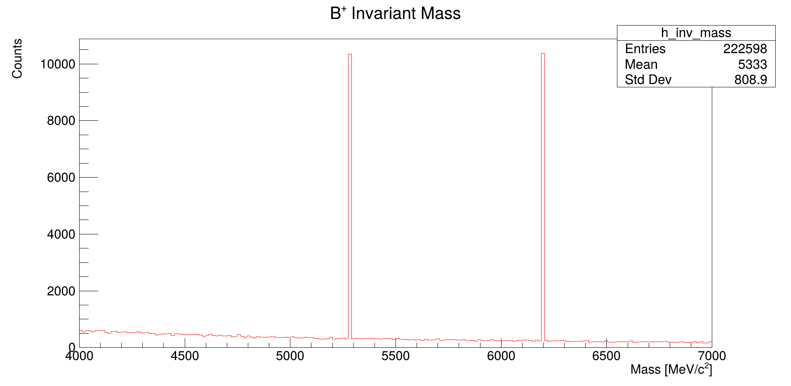

# B⁺ Invariant Mass Reconstruction - Step 5

## Description
This code reconstructs the invariant mass of B⁺ mesons from J/ψ K⁺ decays without particle identification, combining all possible positive particle candidates with μ⁺μ⁻ pairs.

## Key Features
- **Mass Reconstruction**:
  - J/ψ candidates selected in 3.0-3.2 GeV/c² mass window
  - All positive particles (π⁺, K⁺, p, e⁺) combined with J/ψ
  - 200 bins covering 4000-7000 MeV/c² range

- **Analysis Logic**:
  - Three-level combinatorial approach:
    1. Identifies all μ⁺μ⁻ pairs
    2. Selects J/ψ candidates
    3. Combines with positive particles

## Physics Quantities
| Parameter | Value Range | Units | Significance |
|-----------|------------|-------|--------------|
| J/ψ mass window | 3000-3200 | MeV/c² | Signal selection |
| B⁺ mass range | 4000-7000 | MeV/c² | Broad search window |
| Expected peak | ~5279 | MeV/c² | B⁺ nominal mass |

## Physics Context
This analysis demonstrates:
- Combinatorial background challenges in B physics
- Importance of particle ID in high-energy physics
- Invariant mass technique for resonance reconstruction
- Signal extraction from background processes

## Usage Notes
- The histogram shows:
  - True B⁺ signal (expected ~5279 MeV/c²)
  - Combinatorial background
  - Potential peaking backgrounds
- Optional Gaussian fit around B⁺ mass (commented)
- Interactive plot for detailed inspection
