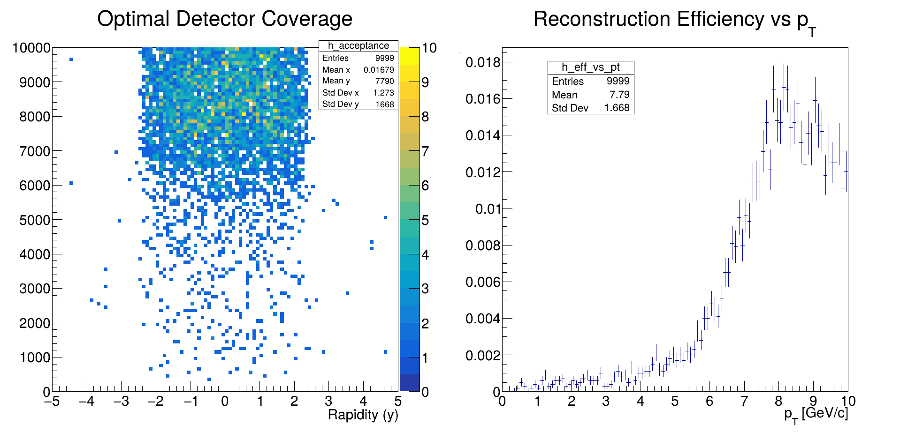

# Detector Optimization Analysis - Step 6

## Description
This code performs detector optimization studies for B⁺ → J/ψ K⁺ reconstruction, analyzing acceptance and efficiency as functions of rapidity and transverse momentum.

## Key Features
- **Acceptance Map**:
  - 2D histogram of B⁺ yield vs (y, pT)
  - Rapidity range: [-5, 5]
  - pT range: [0, 10000] MeV/c
  - COLZ color scale visualization

- **Efficiency vs pT**:
  - Reconstruction efficiency distribution
  - pT range: [0, 10] GeV/c
  - Normalized to total events

## Optimization Parameters
| Parameter | Range | Units | Significance |
|-----------|-------|-------|--------------|
| Rapidity (y) | [-5, 5] | - | Detector coverage |
| pT | [0, 10] | GeV/c | Momentum threshold |
| Efficiency | [0, 1] | - | Reconstruction success rate |

## Physics Context
This analysis helps determine:
- Optimal detector acceptance for B physics
- pT thresholds for trigger efficiency
- Geometric coverage requirements
- Momentum-dependent reconstruction performance

## Key Output
The code prints the suggested optimal coverage:
