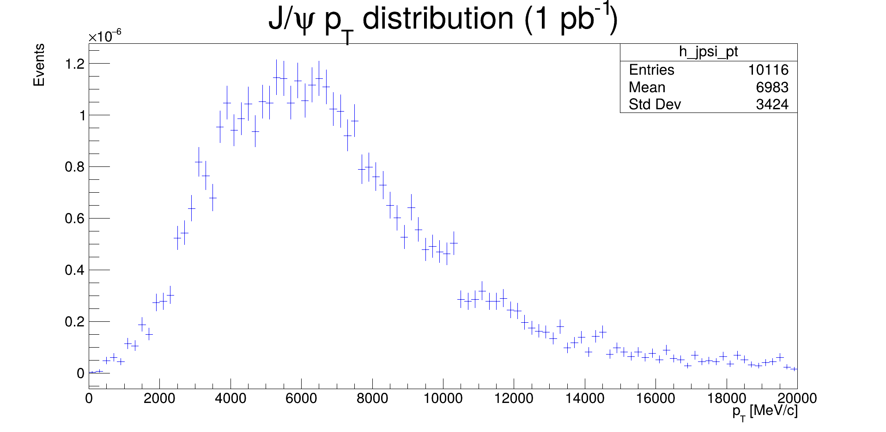

# J/ψ pT Distribution at 1 pb⁻¹ - Step 7

## Description
This code calculates the expected J/ψ transverse momentum distribution from B⁺ → J/ψ K⁺ decays at an integrated luminosity of 1 pb⁻¹, using the known cross-section of 0.0409 mbarn.

## Key Features
- **Physics Scaling**:
  - Converts MC events to physical expectation
  - Applies cross-section (0.0409 mb → 0.0409 nb → 40.9 pb)
  - Normalizes to 1 pb⁻¹ luminosity

- **Distribution Characteristics**:
  - 100 bins in [0, 20000] MeV/c range
  - Blue color scheme
  - Includes statistical information box

## Physics Parameters
| Parameter | Value | Units | Significance |
|-----------|-------|-------|--------------|
| Cross-section | 0.0409 | mbarn | B⁺→J/ψ K⁺ branching |
| Luminosity | 1.0 | pb⁻¹ | Target integrated luminosity |
| pT range | 0-20000 | MeV/c | J/ψ transverse momentum |

## Physics Context
This analysis provides:
- Expected J/ψ yield for luminosity-based analyses
- pT spectrum shape information
- Normalization reference for other measurements
- Data-MC comparison baseline

## Usage Notes
- Plot shows absolute expected yield at 1 pb⁻¹
- Integral gives total expected events
- Printed output confirms normalization
- Interactive for detailed inspection
